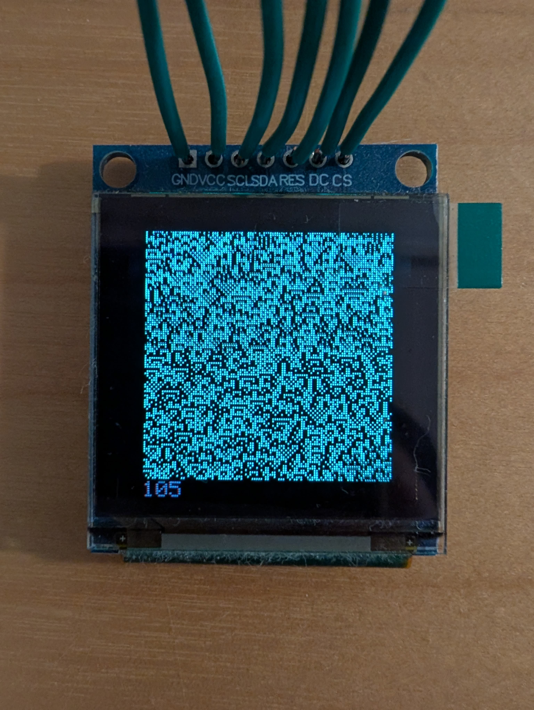

# arduino-ssd1351-ca

An Arduino sketch that animates [Wolfram elementary cellular automata](https://en.wikipedia.org/wiki/Elementary_cellular_automaton) on a 128×128 SSD1351 OLED display over SPI.

A curated set of visually interesting rules cycles continuously, each starting from a random initial state.

## Demo

<video src="https://github.com/user-attachments/assets/a48a4aea-fc59-4fda-9d73-d48d0744ccde" controls width="480"></video>

## Dependencies

- [Adafruit GFX Library](https://github.com/adafruit/Adafruit-GFX-Library)
- [Adafruit SSD1351 Library](https://github.com/adafruit/Adafruit-SSD1351-library)

## Wiring (Arduino Uno)

| SSD1351 pin | Arduino pin |
|-------------|-------------|
| CS          | 10          |
| DC          | 8           |
| RES         | 9           |
| SDA (MOSI)  | 11          |
| SCL (SCK)   | 13          |
| VCC         | 3.3 V       |
| GND         | GND         |

## License

MIT
